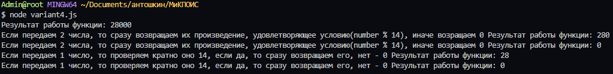

# Метрология и качество программного обеспечения информационных систем

## Индивидуальное задание

### Титов Александр Геннадьевич

> 22.06.2020

### Вариант 5

**Цель работы:** изучить метрики размера программ Холстеда, разработать программы и оценить её сложность, используя метрики Холстеда.

**Задание:** Последовательность натуральных чисел характеризуется числом Х – наибольшим числом, кратным 14 и являющимся произведением двух элементов последовательности с различными номерами. Напишите эффективную, в том числе по используемой памяти, программу (укажите используемую версию языка программирования, например, Borland Pascal 7.0), находящую число X для последовательности натуральных чисел, значение каждого элемента которой не превосходит 1000. Программа должна напечатать найденное число, если оно существует для заданной последовательности, или ноль в противном случае. На вход программе в первой строке подаётся количество чисел N. В каждой из последующих N строк записано одно натуральное число, не превышающее 1000.
Пример входных данных:
5
40
1000
7
28
55
Пример выходных данных для приведённого выше примера входных
данных: 28000.

**Выполнение:** В качестве программы было разработано браузерное приложение на языке программирования JavaScript по варианту задания 5.

```javascript
const filterArray = array => array.filter(item => item <= 1000)

const isMultiple14 = number => number % 14 === 0

const getMultNumbers = array => {
  let result = []

  for (let i = 0; i < array.length; i++) {
    for (let j = 0; j < i + 1; j++) {
      const number1 = array[i]
      const number2 = array[j]

      if (number1 === number2) break

      const mult = number1 * number2

      result.push(mult)
    }
  }

  return result
}

const findNumber = (...sequenceNumbers) => {
  const filteredArr = filterArray(sequenceNumbers)

  if (filteredArr.length === 1 || filteredArr.length === 2) {
    const [number1, number2 = 1] = filteredArr

    const mult = number1 * number2

    return isMultiple14(mult) ? mult : 0
  }

  let arrayNumber14 = getMultNumbers(filteredArr).filter(item => isMultiple14(item))

  return arrayNumber14.length ? Math.max(...arrayNumber14) : 0
}
```

## Результат работы



## Расчет метрик Холстеда
| Номер строки | Словарь операторв *n1*       | Словарь операндов *n2*                     | Общее число операторов *N1*           | Общее число операндов *N2*                                          |
| ------------ |:----------------------------:|:------------------------------------------:|:-------------------------------------:|:-------------------------------------------------------------------:|
|1             |=, <=                         |filterArray, array, item, 1000              |=, <=                                  |filterArray, array, item, item, 1000                                 |
|2             |%, ===                        |isMultiple14, number, 14, 0                 |=, %, ===                              |isMultiple14, number, number, 14, 0                                  |
|3             |                              |getMultNumbers                              |=                                      |getMultNumbers, array                                                |
|4             |                              |result, []                                  |=                                      |result, []                                                           |
|5             |<, ++                         |i,                                          |=, <, ++                               |i, 0, i, array, i                                                    |
|6             |+                             |j, 1                                        |=, <, +, ++                            |j, 0, j, i, 1, j                                                     |
|7             |                              |number1                                     |=                                      |number1, array, i                                                    |
|8             |                              |number2                                     |=                                      |number2, array, j                                                    |
|9             |if, break                     |                                            |if, ===, break                         |number1, number2                                                     |
|10            |*                             |mult                                        |=, *                                   |mult, number1, number2                                               |
|11            |                              |                                            |                                       |result, mult                                                         |
|12            |return                        |                                            |return                                 |result                                                               |
|13            |...                           |findNumber, sequenceNumbers                 |=, ...                                 |findNumber, sequenceNumbers                                          |
|14            |                              |filteredArr                                 |=                                      |filteredArr, filterArray, sequenceNumbers                            |
|15            |||                            |2                                           |if, ===, ||, ===                       |filteredArr, filteredArr, 1, 2                                       |
|16            |                              |                                            |=, =                                   |number1, number2, 1, filteredArr                                     |
|17            |                              |                                            |=, *                                   |mult, number1, number2                                               |
|18            |? :                           |                                            |return, ? :                            |isMultiple14, mult, mult, 0                                          |
|19            |                              |arrayNumber14                               |=                                      |arrayNumber14, getMultNumbers, filteredArr, item, isMultiple14, item |
|20            |Math.max                      |                                            |return, ? :, Math.max, ...             |arrayNumber14, arrayNumber14, 0                                      |
|Количество    |15                            |22                                          |40                                     |68                                                                   |

## Метрики Холстеда
1. Словарь программы (*Halstead Program Vocabulary*, *HPVoc*): n = n1 + n2 = 15 + 22 = 37
2. Длина программы (*Halstead Program Length*, *HPLen*): N = N1 + N2 = 40 + 68 = 108
3. Объем программы (*Halstead Program Volume*, *HPVol*): V = N \* log2(n) = 108 \* 5,209 = 562,572 (бит)
4. Потенциальный объем программы: V\* = n \* log2(n) = 37 \* 5,209 = 192,733 (бит)
5. Информационная длина программы: N\* = n1 \* log2(n1) + n2 \* log2(n2) = 15 \* 3,907 + 22 \* 4,459 = 156,703
6. Уровень качества программирования L (уровень программы): L = V\* / V = 192,733 / 562,572 = 0,343
7. Сложность программы (*Halstead Difficulty*, *HDiff*): D = 1 / L = 1 / 0,343 = 2,915
8. Информационное (интеллектуальное) содержание: I = V / D = 562,572 / 2,915 = 192,9
9. Интеллектуальное усилия (*Halstead Effort*, *HEff*): E = V \* D = V / L = 562,572 / 0,343 = 1640,152
Время на программирование (в условных единицах): T = E / S = 1640,152 / 5 = 328,03, где S – число Страуда (5 < S < 20)
10. Уровень языка выражения: lambda  = V / D2^2 = V \* L^2 = 562,572 \* (0,343)^2 = 66,19
11. Количество ошибок в программе: В = V / 3000 = 562,572 / 3000 = 0,188, где V – объем программы

[Литература](https://ru.wikipedia.org/wiki/Markdown)
